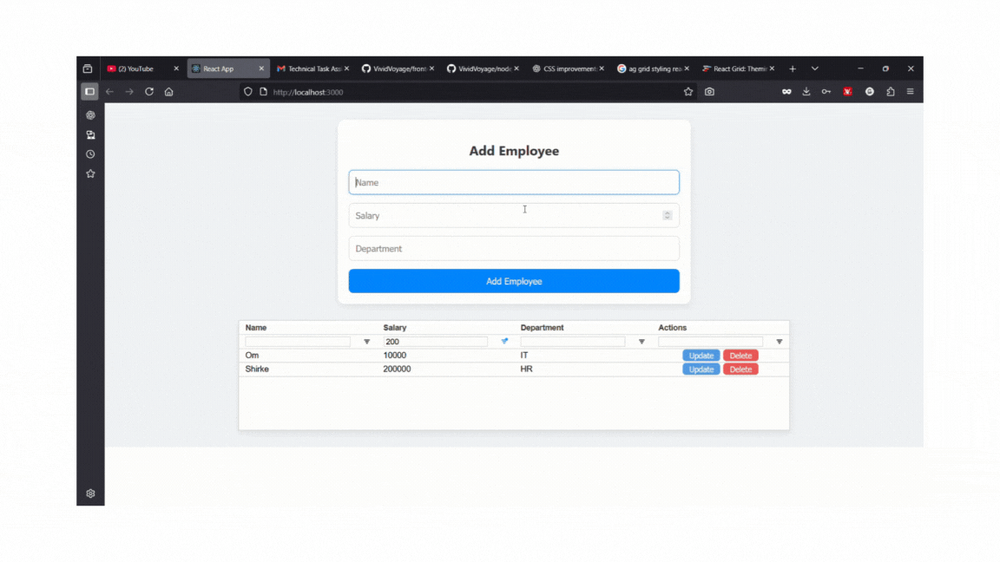

# Employee Management System (React + ag-Grid + Node.js + PostgreSQL)

A full-stack application for managing employee records with **CRUD operations** and **real-time filtering** using `ag-Grid`.  
Built with **React.js** for the frontend, **Node.js/Express.js** for the backend, and **PostgreSQL** for persistent storage.

---

##  Features

- **Add Employee** – Create new employee records through a form.
- **View Employees** – Display employees in a powerful, customizable `ag-Grid` table.
- **Edit Employee** – Update employee details directly from the grid.
- **Delete Employee** – Remove employee records with confirmation.
- **Responsive UI** – Works seamlessly on different screen sizes.

---

##  Tech Stack

### Frontend
- **React.js**
- **ag-Grid**
- **CSS Modules** / Custom Styling

### Backend
- **Node.js** with **Express.js**
- **PostgreSQL** (via `pg` npm package)

---
